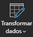
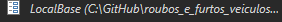
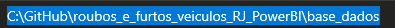
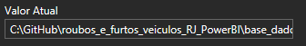

# Análise de Roubos e Furtos de Veículos no estado do Rio de Janeiro

> ℹ️ **NOTE:** Projeto desenvolvido no curso de Análise de dados Com Power BI para plataforma [RioOn](https://rioon.rio.br/) em parceria com o [Senac RJ](https://www.rj.senac.br/).

  

    Demonstração do Projeto

## 📂 Bases de Dados

- [ISP Dados RJ](https://www.ispdados.rj.gov.br/Arquivos/BaseDPEvolucaoMensalCisp.csv)
- [Dados das Delegacias](https://github.com/vivianebatista92/roubos_e_furtos_veiculos_RJ_PowerBI/blob/main/base_dados/DP.csv)

## 🔧 Ferramentas

 

## ✏️ Atividades Propostas

|   **Atividades** |
| ------------------------------------------------------------------------------------------------------------------------------------------------------------------------------------------------------------------------------------------------------------------------------ |
| <li> Importar os dados </li> |
 | <li> ETL dos dados: limpar as colunas desnecessárias ("mes_ano","fase","risp" e "mcirc") e os dados redundantes </li>|
 | <li> Cria a tabela dCalendario com linguagem M </li>|
 | <li> Relacionar as tabelas entre si </li>|
 | <li> Criar segmentações de Região, Delegacias, Municípios, Ano e Mês </li>|

 ## 📈 Análises Desenvolvidas

|   **Análises Realizadas com Medidas DAX** |
| ------------------------------------------------------------------------------------------------------------------------------------------------------------------------------------------------------------------------------------------------------------------------------ |
| <li> Top 10 Crimes </li> |
 | <li> Top 10 Municípios com o maior número de ocorrências </li>|
 | <li> Comparação de regiões por total de ocorrências </li>|
 | <li> Evolução ocorrências por ano e mês </li>|
 | <li> Roubo e Furto de Veículos vs Recuperação de Veículos, por ano e por mês </li>|

 ## ❓ Utilização do Projeto

- O arquivo do Power BI, por possuir uma tabela que não é hospedada em algum site, para funcionar, deve seguir alguns passos:

|   Ação   | Imagem                                                                                                                                                                                                                                                                         |
| :------: | ------------------------------------------------------------------------------------------------------------------------------------------------------------------------------------------------------------------------------------------------------------------------------ |
|  Ao baixar a pasta do projeto, abra o Power BI    |
|  Clicar em Transformar Dados:  |  |
| Clicar em Local Base | |
| Verificar o caminho no seu computador de onde está a tabela DP e copiar |  |
| Colar esse caminho no campo valor do Local Base |  |

#

